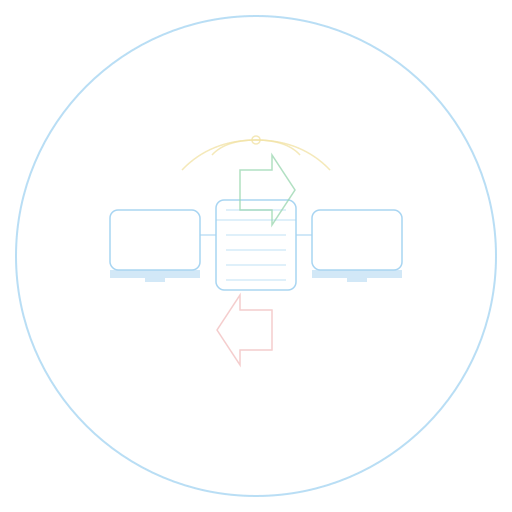

  

# LAN File Transfer Tool

A simple and easy-to-use LAN file transfer tool that allows quick file transfers within a local network. This lightweight application enables seamless file sharing between devices on the same network without the need for complex setup or external services.

## Features

- Simple and intuitive interface
- Support for multiple file uploads (up to 1GB)
- Drag and drop file upload
- Real-time upload progress display
- Direct file download or deletion (supports batch deletion)
- Automatic display of different file type icons
- File size information display
- Can be packaged as an executable file, no Python environment required

## System Requirements

- Windows (tested on Windows 10/11)
- Python 3.8 - 3.13 (compatibility issues with Python 3.13 have been resolved)

## Dependencies

- flask==2.3.3
- flask-socketio==5.3.4
- pywebview==4.3
- simple-websocket==1.0.0
- Werkzeug==2.3.7
- pyinstaller==6.12.0

## Usage

### Method 1: Run Python Script Directly

1. Install dependencies: `pip install -r requirements.txt`
2. Run the application: `python app.py`
3. The program will automatically open a window displaying the file transfer interface

### Method 2: Use Executable File

1. Run the build script: `python build_exe.py` or `build.bat`
2. Wait for the build to complete
3. Find the executable file in the `dist/内网文件传输工具` directory
4. Double-click to run the executable file, which will open a window displaying the file transfer interface

## Python 3.13 Compatibility Note

This project is fully compatible with Python 3.13, using threading mode to run Flask-SocketIO and pywebview as a unified interface to create a standalone application window. All dependencies have been tested for compatibility.

## Build Notes

When building the executable file:
- Uses PyInstaller 6.12.0 for packaging, automatically configuring required dependencies and imports
- Uses single directory mode (--onedir) for packaging, generating a standalone application directory
- Automatically installs all dependencies in requirements.txt
- Automatically creates and configures the uploads directory
- Uses threading mode to run Flask-SocketIO, avoiding gevent compatibility issues
- Supports Windows systems, automatically obtains the local IP address
- Supports Python 3.8 to 3.13 versions, automatically checks version compatibility
- Fully automated build process, no manual configuration required

## Notes

1. The program will create an `uploads` folder in the current directory to store uploaded files
2. The first time you run it, it may be blocked by the firewall, please allow access
3. If you need to run the generated exe file on another computer, you need to copy the entire `dist/内网文件传输工具` directory
4. Close the window to completely exit the application

## License

This project is licensed under the MIT License - see the [LICENSE](LICENSE) file for details.